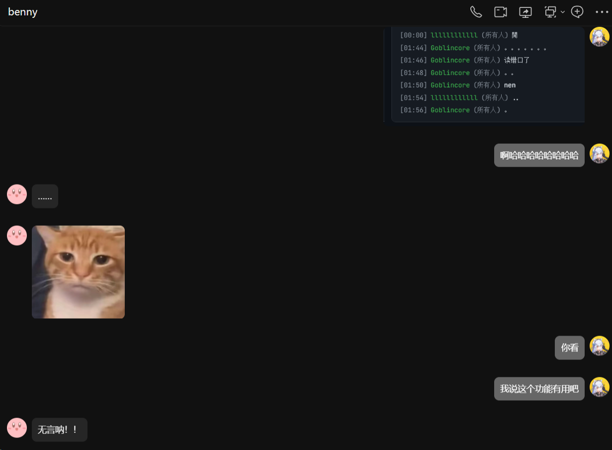

## StarCraft II Replay Analysis - Online


一个基于浏览器端的《星际争霸 II》录像在线解析工具。默认在浏览器本地解析；同时支持将玩家自愿共享的录像上传到独立服务，由服务端二次校验后归档到公开仓库。

### 使用方法

线上演示（GitHub Pages）：https://rep.probius.xyz/

本地预览（**必须从项目根目录**提供 HTTP，勿用浏览器直接双击打开文件，否则 ES Module 与 `fetch("data.json")` 可能失败）：

```bash
python -m http.server 8080
```

浏览器访问 `http://127.0.0.1:8080/` 即可。

开发与维护时，模块职责、解析数据流与发布方式见 **[docs/MAINTENANCE.md](docs/MAINTENANCE.md)**。

### 项目结构（零构建）

仓库为纯静态资源，无 `npm` / 打包步骤，GitHub Actions 直接发布整仓。

| 路径 | 说明 |
|------|------|
| `index.html` | 本地解析主页面（含共享上传入口） |
| `replays.html` | 共享录像检索页面 |
| `css/app.css` | 全局样式 |
| `js/app.js` | 本地解析页面入口 |
| `js/replays_page.js` | 共享录像页入口 |
| `js/parse_script.js` | 内嵌 Python 解析脚本（供 Pyodide 执行） |
| `js/*.js` | 其余按功能拆分的逻辑（状态、Pyodide 启动、展示、批量侧栏、语音、图表等） |
| `server/` | 独立 FastAPI 服务（本地持久化 + 公共查询 + 后台管理 + 可选同步） |
| `data.json` | 单位/建筑/升级等中文翻译数据 |
| `docs/MAINTENANCE.md` | 维护说明与模块对照表 |

### 功能概述

- **纯前端运行**：使用 Pyodide 在浏览器中加载 Python 运行时与第三方库完成解析，录像文件不会上传到服务器。
- **可选共享上传**：在本地解析完成后，玩家可勾选同意项并提交留言（50字内）；服务端会再次校验大小/格式/摘要字段，先本地持久化，再按周期可选同步到公开仓库。
- **共享录像检索**：`replays.html` 使用服务端公共接口检索，支持关键词检索、置顶展示、点赞计数与按点赞排序；点击后按需从服务端拉取录像并复用同一解析渲染链路。
- **后台管理面板**：服务端提供 Bearer Token 保护的管理页，可人工置顶、编辑标签与留言等元数据。
- **批量录像**：支持一次选择或拖入多个 `.SC2Replay`，顺序解析；左侧**独立悬浮**摘要面板展示每场地图、玩家（含种族）、胜者、时长、区域、客户端版本；右缘可**拖动调节面板宽度**（宽度会记入本地存储）；点击某张卡片可在主区域切换该场的完整分析（建造表、聊天、图表等）。悬浮层**不挤压**中间主内容宽度。
- **对战信息展示**：展示地图名称、对局时长等基础信息。
- **聊天消息**：还记得那天对局你们聊了什么么？精准还原，身临其境w！
- **造兵/建筑时间轴**：按时间顺序显示双方建造顺序，可切换“开始建造时间 / 完成建造时间”两种模式。
- **升级与技能事件**：支持展示科技升级完成时间以及“星空加速（Nexus Mass Recall）”等关键技能事件。
- **中英双语名称**：通过本地 `data.json` 进行单位、建筑与升级的中文翻译，支持切换显示原始英文名称。
- **无视版本**：不管现在的客户端是否能播放，只要数据完好，都能看！（理论支持15405-95299版本，不过好像一些资料片调整没法避免，至少我测试了2018年的录像还能提取）
- **对局分析图表**：解析成功后，若能从 Tracker 事件汇总出玩家按分钟的统计数据，会在建造列表下方自动展示「对局分析」区块（基于 **Chart.js 4**）。当前包含五张折线图，便于对比双方曲线：
  - **农民数量**：按游戏内时间（更快）采样，横轴为游戏分钟、每秒一点；无曲线数据时回退为按分钟的 `workers` 统计。
  - **军队价值**：每名玩家矿物 /瓦斯两条线（虚线区分瓦斯）。
  - **采集速率**：矿物与瓦斯采集速率（虚线区分瓦斯）。
  - **人口 / 补给**：已用人口与补给上限（虚线区分补给上限）。
  - **工人战损**：累计击杀工人与累计损失工人（虚线区分损失）。  
  多玩家时以不同色相区分；图表随重新解析录像而销毁并重绘。



---

### 依赖说明

本项目的核心解析逻辑基于 Python 社区开源库 **sc2reader**：

- **sc2reader**：用于读取并解析 `.SC2Replay` 文件，提取玩家、单位、建筑、升级、事件等结构化数据。
- 通过 Pyodide 在浏览器中安装并运行 `sc2reader`，结合自定义脚本，将解析结果序列化为 JSON，再由前端渲染为时间轴视图。

### 上传服务部署（可选）

如需启用“共享上传”，需要额外部署 `server/` 下的 FastAPI 服务。默认以本地持久化为主，GitHub 同步可按开关启用。

- 文档：[`server/README.md`](server/README.md)
- 默认上传地址：`https://replayapi.s.3q.hair/api/replays/upload`（可通过前端全局变量覆盖）


---

### 许可证与致谢

- 感谢全科普鲁星区最温柔善良可靠的贝妮小姐w！
- 致谢 https://github.com/wayne19980/sc2build-tts ，感谢 @wayne19980 老师


- **sc2reader（依赖库）**

  本项目依赖的 `sc2reader` 源码来自 `ggtracker/sc2reader`，其遵循 MIT 许可证，声明如下：

  > The MIT License, http://www.opensource.org/licenses/mit-license.php  
  >  
  > Copyright (c) 2011-2013 Graylin Kim  
  >  
  > ...
  
- **SC2ReplayAnalyzer-main（数据翻译参考来源）**

  本项目中 `data.json` 的部分中文翻译与升级时间数据参考自 `AltriaZ0/SC2ReplayAnalyzer` 项目中的`.toml`文件，其遵循 MIT 许可证，声明如下：

  > MIT License  
  >  
  > Copyright (c) 2024 AltriaZ0  
  >  
  > ...

在此对 **sc2reader** 以及 **SC2ReplayAnalyzer-main** 项目作者和贡献者表示感谢。

### 更新日志

```build-260419
*前端工程化（零构建拆分）：
- 原单文件 `index.html` 内联样式与脚本，已拆分为 `css/app.css` 与多份 `js/*.js`（ES Module，`js/app.js` 为入口）；行为与 DOM `id` 保持兼容，部署仍为静态文件，无需打包命令。
- 新增 [docs/MAINTENANCE.md](docs/MAINTENANCE.md)，说明各文件职责、解析链路、本地运行与改动的推荐入口。

*批量录像与左侧摘要：
- 文件选择框支持 `multiple`，拖放区可一次接收多个录像；解析队列在浏览器内顺序执行，避免临时文件路径冲突。
- 左侧为圆角悬浮面板（类似独立浮窗），展示每场摘要并可切换当前详单；宽屏下可拖动右缘调整宽度；窄屏下列表以流式区域展示，隐藏拖宽手柄。

*说明与修复：
- README 补充「项目结构」表、本地 HTTP 注意事项；修复入口 `app.js` 对 `collectSc2ReplayFiles` 的导入路径（应从 `format_utils.js` 引用）。
```

```build-260412
*对局分析图表（README说明补全）：
在「功能概述」中写明五类 Chart.js 图表的含义、数据来源（Tracker / workers_curve）及展示条件。

*建造顺序语音播报（Build Order Reader）：
-语音步骤与左侧建造列表使用同一套时间排序；修复 Python 将「星空加速 / recall」追加在 build_order 末尾导致未排序时，播报顺序与界面不一致、甚至出现跳到后期步骤的问题。
- Document画中画改为横向信息条：大号计时、当前步骤与多步预览、双进度条；PiP 内不展示语速/语言等设置；支持随窗口缩放、主面板「画中画字号」调节（localStorage 记忆）；PiP 内提供「开始 / 暂停」。
- 语音合成：同一定时周期内只前进一条播报，避免同秒多条瞬间入队；新一条播报前 cancel 队列，减轻叠音；拖动时间轴过程中仅同步进度不播报，松手后再播当前步。
- 「星空加速」类步骤的朗读文案缩短为「加速加某建筑」式读法，减轻 TTS 冗长与异常感。

*建造列表：已移除「显示初始化事件」开关及对 0 秒事件的过滤（与 spawningtool 整理后的数据一致，见 build-260310 日志）。
```

```build-260310
*虫族单位开始时间修正:
sc2reader 对虫族单位（通过幼虫孵化）的 started_at 没有做「建造时间回推」，
导致 start_time 和 finish_time 相同，都是「孵化完成时刻」。采用回推策略，
将 start_time 设置为孵化开始时刻，finish_time 设置为孵化完成时刻。

*建造列表：不再提供 “显示初始化事件” 开关及对 0 秒事件的过滤；后端使用 spawningtool 等已整理好的建造顺序，直接按数据展示。

*前端时间轴渲染调整:
时间轴排序与展示逻辑统一基于修正后的 start_time / finish_time。
```

