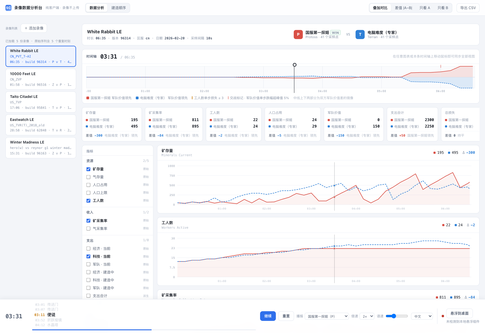
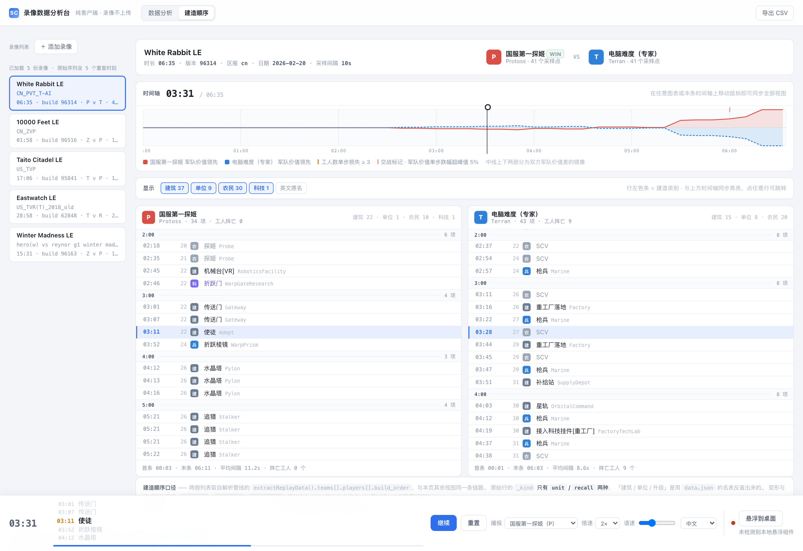

## StarCraft II Replay Analysis - Online


一个基于浏览器端的《星际争霸 II》录像分析工具。**全部解析在本地完成，录像文件不会上传到任何服务器。**

> **2026-09 产品方向调整**：**「共享录像库」功能已下线**（无自建后端可持续运营），
> 站点转为**纯客户端**。`replays.html` 与上传相关代码保留在仓库中但已从导航移除，不再维护。
> 主页面重做为「**录像数据分析台**」：官方回放 overlay 口径的 28 张指标图 + 建造顺序 + 语音播报。

### 使用方法

线上演示（GitHub Pages）：https://rep.probius.xyz/

本地预览（**必须从项目根目录**提供 HTTP，勿用浏览器直接双击打开文件，否则 ES Module 与 `fetch("data.json")` 可能失败）：

```bash
python -m http.server 8080
```

浏览器访问 `http://127.0.0.1:8080/`，把 `.SC2Replay` 拖进页面即可（可一次拖多个）。

开发与维护时，模块职责、解析数据流与发布方式见 **[docs/MAINTENANCE.md](docs/MAINTENANCE.md)**。

### 待补的可选组件

**桌面悬浮窗（`sc2-overlay.exe`）尚未实现。** 它是一个**可选**的 Windows 小组件：
装了就有一个无边框、置顶、逐像素透明、点击穿透的建造轴浮层；
**不装也完全不影响使用**，此时「悬浮到桌面」会降级为浏览器自带的 Document 画中画
（顶部会带浏览器标题栏，且不能透明）。

- 视觉规格稿：`prototype/overlay-exe.html`（四种版式，`?embed=1` 即 exe，里 WebView2 要加载的形态）
- 方案调研（含通道设计、反作弊边界、Win32 细节）：`docs/RESEARCH-ALWAYS-ON-TOP-OVERLAY.md`

### 项目结构（站点零构建）

站点自身仍是**纯静态、零构建**：没有打包器、没有 `node_modules`，GitHub Actions 直接发布整仓。
唯一的「构建」发生在 **CI**（`.github/workflows/build-wasm.yml`）：Rust → wasm、Worker TypeScript → JS，
产物提交回仓库（`wasm/pkg/`、`js/worker/**/*.js`），所以本地开发**不用**装 Rust / TypeScript。

| 路径 | 说明 |
|------|------|
| `index.html` | **主页面**（录像数据分析台）：左侧录像列表侧边栏 + 数据分析 / 建造顺序两个视图 + 底部语音播报条 + 悬浮通道 |
| `css/lab.css` | 主页面的设计系统（浅色；`--a` 红 = 玩家 A、`--b` 蓝 = 玩家 B） |
| `js/lab/main.js` | 主页面编排层：文件输入 → 解析 → 适配 → 挂载；运行态（初始化 / 进度 / 错误） |
| `js/lab/data.js` | **数据适配层**：`ReplayData` → 视图层形状（含 39 字段短名映射、建造项分类、玩家时间网格对齐） |
| `js/lab/views.js` | 视图层（**由脚本从原型逐字节提取**，见 `scripts/extract-lab-views.mjs`）：全部渲染与交互 |
| `js/parse_client.js` | 主线程解析门面：拉起解析 Worker、`parseReplayBufferToData` |
| `js/worker/` | **解析 Worker**：MPQ 容器 + 六流协议解码 + `ReplayData` 组装（TS，由 CI 转译） |
| `wasm/` | Rust 源码与其 wasm 产物（bzip2 解压等热点） |
| `data.json` | 单位 / 建筑 / 升级等中文译名（建造顺序的分类与显示都依赖它） |
| `prototype/` | **设计来源**：交互原型、以及 `extract-lab-*.mjs` 提取生产文件时所依赖的模板。⚠️ 不要删，提取脚本靠它 |
| `tests/baseline/` | `ReplayData` 字段级对拍的金标准快照 |
| `tests/screenshots-lab/` | 生产页面端到端验收的截图产物 |
| `scripts/` | codegen 与验收脚本（`gen-*.py` / `verify-*.mjs` / `extract-lab-*.mjs` / `research/`） |
| `docs/` | 维护说明与调研报告（功能全集、竞品矩阵、悬浮窗方案） |

**已删除（2026-09-22 UI 重构）**：
上一代 UI 的 `css/app.css`、`js/app.js`、`js/display.js`、`js/display_helpers.js`、
`js/voice_reader.js`、`js/benchmarks.js`、`js/batch_rail.js`、`js/constants.js`、
`js/format_utils.js`、`js/export_build.js`；共享录像库的 `replays.html`、`js/replays_page.js`、
`js/share_upload.js`、`js/upload_api.js`、`js/telemetry.js`；以及未入仓的 `server/`。
删完后 `js/` 下 **44 个模块全部可达** —— 用 `node scripts/analyze-module-reachability.mjs` 核验
（它连 `new Worker(...)` / `new URL("...", import.meta.url)` 这类**字符串路径**的边都会走）。
仍保留 `tools/baseline/parse_script.py`：重建金标准基准要用的冻结参考，**不是死代码**。

### 功能概述

- **纯前端运行**：解析全部在浏览器里完成 —— Rust→WASM 负责容器解压，TypeScript 解码器在 **Web Worker** 中还原六个事件流并组装 `ReplayData`。**不加载 Python 运行时**，主线程不参与解析，大录像与多文件批量时页面不再冻结；**录像文件不会上传**。
- **39 个计分字段完整呈现**：官方客户端回放 overlay（Resources / Income / Spending / Army / Losses）所用的 `SPlayerStatsEvent` 有 **39 个 `m_scoreValue*` 字段**，本页把它们做成 **28 张可视图表**（少数为派生求和，如「军队价值 = 矿 + 气」）。字段口径与官方完全一致，因此零学习成本。
- **全局时间轴为主控**：一条时间轴显示双方军队价值差的镜像包络，自动标记**交战**与**工人批量损失**事件；在任意图表或时间轴上移动鼠标，全部视图（读数卡 / 图表游标 / 采样表）同步。
- **读数卡与差值**：8 个核心指标双方对位，带差值与「谁领先」。
- **原始采样表 + CSV 导出**：可选指标跟随游标高亮滚动；一键导出 39 字段 × 双方的完整宽表。
- **建造顺序**：双列对位、按分钟分组、类别色条（建筑 / 单位 / 科技 / 农民 / 星空加速）、跟随时间轴高亮、点行跳转、类别筛选、中英双语、工人阵亡计数。
  > 原始 `build_order._kind` **只有 `unit` / `recall` 两种**，「建筑 / 单位 / 升级」是用 `data.json` 名表反查的 —— 这是旧链路 `itemIsTechUpgrade()` 的同一判据。
- **语音播报**：把建造顺序按时间轴朗读出来，可调倍速（1/2/4/8×）与语速、可切换播报对象与语言；**播报会推进全局时间轴**，切样本 / 切对象 / 改筛选都不打断。
- **桌面悬浮（可选）**：见上文「待补的可选组件」。未安装时降级为浏览器 Document 画中画。
- **批量录像**：一次拖入多个 `.SC2Replay`，在**左侧录像列表侧边栏**（吸顶、可滚动）里切换；
  单份解析失败不会影响其余，失败原因在错误条里逐条列出。
- **无视版本**：只要数据完好就能看（含 2018 年的 HotS 老录像）。





---

### 依赖说明

解析逻辑是**对既有 Python 生态实现的等价重写**，语义对齐对象为：

- **sc2reader 1.9.0** 与 **spawningtool 3.0.0**：站点以前直接在浏览器里跑这两个库（Pyodide）；
  现在的 TypeScript 解码器逐字段复刻它们的输出，判据是 `tests/baseline/*.json`
  —— 由它们离线生成的冻结快照（源码 `tools/baseline/parse_script.py`，生成脚本 `scripts/freeze-baseline.py`）。
- **运行时不依赖 Python**：这两个库只在**重建基准**时需要，站点实际加载的产物是
  `wasm/pkg/*.wasm` 与 `js/worker/**/*.js`。改动解析口径后必须重新冻结基线并跑
  `scripts/verify-replay-data.mjs`，流程见 [docs/MAINTENANCE.md](docs/MAINTENANCE.md)。

### ~~上传服务部署（可选）~~ —— 已下线并移除

**共享上传与共享录像检索已于 2026-09 下线**（无自建后端可持续运营），站点转为纯客户端。
相关的 `server/`（FastAPI 服务）、`replays.html`、`js/replays_page.js`、`js/share_upload.js`、
`js/upload_api.js`、`js/telemetry.js` 已于 2026-09-22 **从仓库删除**（被删文件都在 git 历史里）。
如需重新启用，得先自行评估服务端托管与内容审核成本，再从头实现。

- ~~文档：`server/README.md`~~（未入仓，本机亦已不存在）
- ~~默认上传地址：`https://replayapi.s.3q.hair/api/replays/upload`~~


---

### 许可证与致谢

- 感谢 贝妮小姐
- 致谢 https://github.com/wayne19980/sc2build-tts ，感谢 @wayne19980 老师


- **sc2reader（依赖库）**

  本项目依赖的 `sc2reader` 源码来自 `ggtracker/sc2reader`，其遵循 MIT 许可证，声明如下：

  > The MIT License, http://www.opensource.org/licenses/mit-license.php  
  >  
  > Copyright (c) 2011-2013 Graylin Kim  
  >  
  > ...
  
- **SC2ReplayAnalyzer-main（数据翻译参考来源）**

  本项目中 `data.json` 的部分中文翻译与升级时间数据参考自 `AltriaZ0/SC2ReplayAnalyzer` 项目中的`.toml`文件，其遵循 MIT 许可证，声明如下：

  > MIT License  
  >  
  > Copyright (c) 2024 AltriaZ0  
  >  
  > ...

在此对 **sc2reader** 以及 **SC2ReplayAnalyzer-main** 项目作者和贡献者表示感谢。

### 更新日志

```build-260922
*主页面重做为「录像数据分析台」，砍掉共享录像库，站点转为纯客户端：
- 新增 js/lab/ 三个模块：main.js（编排：文件输入 → 解析 → 适配 → 挂载）、
  data.js（适配层：ReplayData → 视图层形状）、views.js（渲染与交互，由
  scripts/extract-lab-views.mjs 从原型 prototype/data-lab.template.html 逐字节提取）。
- index.html 整页重做：官方回放 overlay 口径的 28 张指标图（39 个 m_scoreValue* 字段）、
  全局时间轴主控（军队价值差镜像包络 + 交战/工人损失事件标记）、8 张读数差值卡、
  原始采样表 + CSV 导出、建造顺序双列视图、语音播报条、悬浮通道。移除 Chart.js CDN 依赖。
- 解析层新增 stats_series（列式，39 字段完整原始采样序列），与 stats[]（逐分钟摘要）
  并存。⚠️ 时间基准改用录像是自己的帧率常量（gameloop / fps），与 game_length 同基准；
  旧 stats[].minute 硬编码 /1.4 的口径错位仅保留在旧字段里，未动（避免破坏对拍）。
- 砍掉共享录像库：index.html 移除导航与上传入口；replays.html、replays_page.js、
  share_upload.js、upload_api.js、telemetry.js、server/ 保留在仓库但不再维护、不再被引用。
- 上一代 UI 模块（app.js / display.js / voice_reader.js / benchmarks.js / batch_rail.js 等）
  保留未删但已无页面引用，仅为回退。
- 新增验收：verify-lab-page.mjs（真实 HTTP + 真实 Chromium + 5 份真实录像的端到端验收，
  含 43 个 DOM 契约 id、跨样本重建、游标联动、建造顺序跳转、语音状态机、悬浮降级、CSV 下载）。
- 新增提取工具：extract-lab-css.mjs / extract-lab-views.mjs（原型 → 生产，带断言式定点替换与自检）。
- **删除全部旧代码**（不再是「保留未引用」）：上一代 UI 的 14 个模块（css/app.css、js/app.js、
  js/batch_rail.js、js/benchmarks.js、js/constants.js、js/display.js、js/display_helpers.js、
  js/export_build.js、js/format_utils.js、js/replays_page.js、js/share_upload.js、js/telemetry.js、
  js/upload_api.js、js/voice_reader.js）与 replays.html。新增 scripts/analyze-module-reachability.mjs
  做依赖闭包核验（连 new Worker / new URL(..., import.meta.url) 这类字符串路径的边都会走），
  现 js/ 下 44 个模块全部可达、零死代码。
- **录像列表改为左侧吸顶侧边栏**（236px，与「指标分组」侧栏同宽；≤1180px 退回顶部横排），
  含「＋ 添加录像」入口与加载状态提示。
- **修掉底部播报条的位置缺陷**：原先 .vb 横跨视口且自己就是 flex 容器，内容从视口左缘起排，
  与居中的主体（max-width 1600）错位 —— 实测 1920 屏偏 142px、2560 屏偏 462px。
  现拆成 .vb（背景层）+ .vbin（内容层，与主体同宽居中）；条高由 ResizeObserver 写入 CSS 变量 --vbh，
  供页面底部留白与各吸顶侧栏扣减（窄屏条会换行变高，写死 84px 会压住内容）。
  ⚠️ 页面底部留白由 &lt;footer class="pagefoot"&gt; 承担 —— 不能写成 body{padding-bottom}，
  因为 lab.css 里有 html,body{height:100%}，body 的 content box 固定为视口高、溢出的内容会**穿过** padding 区。
- 新增 scripts/research/probe-layout.mjs：5 种视口 × 空态/有数据的几何契约探针
  （条贴底 / 与主体对齐 / 不遮挡页脚与侧栏 / 侧栏竖排可滚）。
```

```build-260921
*解析内核替换为 Rust/WASM + TypeScript Worker（正式下线 Pyodide）：
- 新增 js/worker/：MPQ 容器解析、六个事件流的协议解码，以及 build_order / worker_deaths / stats /
  workers_curve / chat 的组装（decoder/replay_data.ts），产出与旧链路 extract_replay_data 同构的 ReplayData。
- 解析从主线程搬进 Web Worker：新增 js/parse_client.js（initParser / parseReplayBufferToData / isParserReady），
  app.js / batch_rail.js / replays_page.js 全部改走 Worker，大录像与多文件批量时页面不再冻结。
- 移除 Pyodide：删除 js/parse_script.js、js/pyodide_boot.js，去掉 index.html / replays.html 的 pyodide.js CDN 引用，
  constants.js 的 PYODIDE_VERSION 与 state.js 的 appState.pyodide 一并移除；首屏不再下载 Python 运行时。
- 旧解析脚本迁至 tools/baseline/parse_script.py，只作为 tests/baseline/ 金标准的生成源保留（离线运行，不进站点）。
- 新增验收脚本：verify-replay-data.mjs（ReplayData 对基线的字段级 diff，parity / 发布两趟口径）、
  verify-worker.mjs（真跑 parse.worker.js 的端到端通道验收）。
```

```build-260419
*前端工程化（零构建拆分）：
- 原单文件 `index.html` 内联样式与脚本，已拆分为 `css/app.css` 与多份 `js/*.js`（ES Module，`js/app.js` 为入口）；行为与 DOM `id` 保持兼容，部署仍为静态文件，无需打包命令。
- 新增 [docs/MAINTENANCE.md](docs/MAINTENANCE.md)，说明各文件职责、解析链路、本地运行与改动的推荐入口。

*批量录像与左侧摘要：
- 文件选择框支持 `multiple`，拖放区可一次接收多个录像；解析队列在浏览器内顺序执行，避免临时文件路径冲突。
- 左侧为圆角悬浮面板（类似独立浮窗），展示每场摘要并可切换当前详单；宽屏下可拖动右缘调整宽度；窄屏下列表以流式区域展示，隐藏拖宽手柄。

*说明与修复：
- README 补充「项目结构」表、本地 HTTP 注意事项；修复入口 `app.js` 对 `collectSc2ReplayFiles` 的导入路径（应从 `format_utils.js` 引用）。
```

```build-260412
*对局分析图表（README说明补全）：
在「功能概述」中写明五类 Chart.js 图表的含义、数据来源（Tracker / workers_curve）及展示条件。

*建造顺序语音播报（Build Order Reader）：
-语音步骤与左侧建造列表使用同一套时间排序；修复 Python 将「星空加速 / recall」追加在 build_order 末尾导致未排序时，播报顺序与界面不一致、甚至出现跳到后期步骤的问题。
- Document画中画改为横向信息条：大号计时、当前步骤与多步预览、双进度条；PiP 内不展示语速/语言等设置；支持随窗口缩放、主面板「画中画字号」调节（localStorage 记忆）；PiP 内提供「开始 / 暂停」。
- 语音合成：同一定时周期内只前进一条播报，避免同秒多条瞬间入队；新一条播报前 cancel 队列，减轻叠音；拖动时间轴过程中仅同步进度不播报，松手后再播当前步。
- 「星空加速」类步骤的朗读文案缩短为「加速加某建筑」式读法，减轻 TTS 冗长与异常感。

*建造列表：已移除「显示初始化事件」开关及对 0 秒事件的过滤（与 spawningtool 整理后的数据一致，见 build-260310 日志）。
```

```build-260310
*虫族单位开始时间修正:
sc2reader 对虫族单位（通过幼虫孵化）的 started_at 没有做「建造时间回推」，
导致 start_time 和 finish_time 相同，都是「孵化完成时刻」。采用回推策略，
将 start_time 设置为孵化开始时刻，finish_time 设置为孵化完成时刻。

*建造列表：不再提供 “显示初始化事件” 开关及对 0 秒事件的过滤；后端使用 spawningtool 等已整理好的建造顺序，直接按数据展示。

*前端时间轴渲染调整:
时间轴排序与展示逻辑统一基于修正后的 start_time / finish_time。
```

