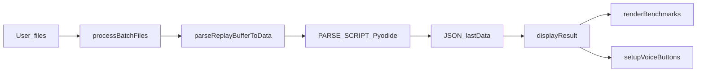

# 维护说明（前端结构）

本项目为**零构建**静态站点：GitHub Actions 直接发布仓库根目录，无需 `npm run build`。

## 本地运行

必须通过 **HTTP** 访问（ES Module 与 `fetch("data.json")` 在 `file://` 下常不可用）：

```bash
python -m http.server 8080
```

浏览器打开 `http://localhost:8080/`（根目录需包含 `index.html`、`css/`、`js/`、`data.json`）。

## 目录与模块职责

| 路径 | 职责 |
|------|------|
| [index.html](../index.html) | 页面骨架、CDN 脚本（Pyodide、Chart.js）、`type="module"` 入口 |
| [css/app.css](../css/app.css) | 全部样式 |
| [js/app.js](../js/app.js) | 入口：勾选框、拖放、聊天按钮、侧栏宽度、初始化 |
| [js/state.js](../js/state.js) | 跨模块共享可变状态 `appState` |
| [js/constants.js](../js/constants.js) | 版本号、游戏时间系数、localStorage 键等常量 |
| [js/format_utils.js](../js/format_utils.js) | 时间/文件大小/转义等纯函数 |
| [js/errors_init.js](../js/errors_init.js) | `showError` / `hideError` / Pyodide 初始化文案、`loadTranslationData` |
| [js/parse_script.js](../js/parse_script.js) | **仅**内嵌 Python：`export const PARSE_SCRIPT`（Pyodide 执行） |
| [js/pyodide_boot.js](../js/pyodide_boot.js) | `initPyodide`、`parseReplayBufferToData` |
| [js/batch_rail.js](../js/batch_rail.js) | 批量录像悬浮窗、宽度拖拽与持久化、`processBatchFiles` |
| [js/display_helpers.js](../js/display_helpers.js) | 翻译表查询、建造项展示文本、`compareBuildOrderItems`（语音与列表共用） |
| [js/display.js](../js/display.js) | `renderChat`、`displayResult`（主结果区 + 联动图表/导出/语音按钮） |
| [js/export_build.js](../js/export_build.js) | 建造列表导出 TXT |
| [js/voice_reader.js](../js/voice_reader.js) | 语音播报、时间轴、Document PiP；`initVoiceReader()` 绑定 DOM 事件 |
| [js/benchmarks.js](../js/benchmarks.js) | Chart.js 对局分析图表；实例挂在 `appState.chartInstances` |

**改功能时建议打开的文件：**

- 只改样式 → `css/app.css`
- 改解析字段/逻辑 → `js/parse_script.js`，并视情况改 `display.js` / `batch_rail.js` 展示列
- 改批量侧栏交互 → `js/batch_rail.js`
- 改主界面/建造表/聊天 → `js/display.js` + `js/display_helpers.js`
- 改语音 → `js/voice_reader.js`
- 改图表 → `js/benchmarks.js`
- 升级 Pyodide 版本 → `js/constants.js`（`PYODIDE_VERSION`）与 `index.html` 中 pyodide.js CDN URL 保持一致

## 数据流（简图）



## 依赖版本（与 README 交叉引用）

- **Pyodide**：`js/constants.js` 中 `PYODIDE_VERSION`，与 `index.html` 的 `pyodide.js` CDN 路径一致。
- **Chart.js**：`index.html` 中 UMD 脚本；`benchmarks.js` 使用全局 `Chart`。
- **解析库**：运行时由 micropip 安装 `sc2reader`、`spawningtool`（见 `pyodide_boot.js`）。

## 发布

推送至默认分支后，[.github/workflows/static.yml](../.github/workflows/static.yml) 将整仓作为静态资源发布；**无需**本地打包步骤。

## 注意事项

- 修改 `parse_script.js` 时，勿在 Python 字符串中引入未转义的 `` ` `` 或 `${`（会破坏 JS 模板字符串）；若必须出现，在 JS 侧用 `\`` / `\${` 转义。
- 新增模块时请避免 **循环 import**（当前：`batch_rail` → `display` → `voice_reader` / `benchmarks`，不再反向依赖 `batch_rail`）。
