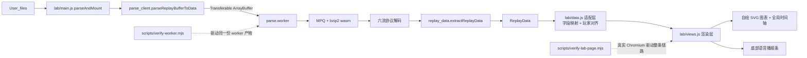

# 维护说明（前端结构）

站点为**零构建**静态资源：GitHub Actions 直接发布仓库根目录，**没有** `npm run build`。
唯一的构建步骤在 CI（`.github/workflows/build-wasm.yml`）：Rust → wasm 与 Worker TypeScript → JS，
产物提交回仓（`wasm/pkg/`、`js/worker/**/*.js`），因此本地无需 Rust / TypeScript 工具链。

> **解析已不依赖 Python。** 旧链路（Pyodide + `sc2reader` + `spawningtool`）已于 2026-09-21 下线，
> 现在是「Rust/WASM 解压 + TypeScript 解码器 + Web Worker」。旧解析脚本作为**冻结参考**留在
> `tools/baseline/parse_script.py`，仅用于重建 `tests/baseline/` 金标准，站点不加载它。

## 本地运行

必须通过 **HTTP** 访问（ES Module 与 `fetch("data.json")` 在 `file://` 下常不可用）：

```bash
python -m http.server 8080
```

浏览器打开 `http://localhost:8080/`（根目录需包含 `index.html`、`css/`、`js/`、`data.json`）。

## 目录与模块职责

> **2026-09-22 起主页面已重做**（「录像数据分析台」）。下表是当前仓库里**全部**前端模块 ——
> 上一代 UI 与共享录像库已在本轮删除，`js/` 下 44 个模块**全部可达、无死代码**（见文末「已删除」）。

### 当前页面（`index.html`）

| 路径 | 职责 |
|------|------|
| [index.html](../index.html) | 页面骨架 + `type="module"` 入口。**只引用 `css/lab.css` 与 `js/lab/main.js`**，无任何 CDN 依赖 |
| [css/lab.css](../css/lab.css) | 主页面设计系统。由 `scripts/extract-lab-css.mjs` 从原型提取 + 追加「运行态外壳」 |
| **[js/lab/main.js](../js/lab/main.js)** | 编排层：文件输入 / 进度 / 错误 → 解析 → 适配 → 挂载；并挂 `window.__lab` 调试句柄 |
| **[js/lab/data.js](../js/lab/data.js)** | **数据适配层**：`ReplayData` → 视图层形状。含 39 字段短名映射、建造项分类（查 `data.json` 名表）、**玩家时间网格对齐** |
| **[js/lab/views.js](../js/lab/views.js)** | 视图层：全部渲染与交互（数据分析视图 / 建造顺序 / 语音播报 / 悬浮探测降级）。**由脚本提取，见下** |
| **[js/lab/sandbox.js](../js/lab/sandbox.js)** | **沙盘模拟视图**（手写模块，非提取产物）：读 `ReplayData.sandbox` 在 canvas 上重演对局；经 `sandboxSeek()` 推进全局游标，与 views.js 刻意零侵入（见下） |
| [js/state.js](../js/state.js) | 跨模块共享状态 `appState`（新页面只用它的 `translationData` 与 `parserReady`） |
| [js/errors_init.js](../js/errors_init.js) | `loadTranslationData()`（读 `data.json`）、`setInitStatus()` |
| [js/parse_client.js](../js/parse_client.js) | **主线程解析门面**：`initParser` / `parseReplayBufferToData` / `isParserReady` / `releaseParser` |
| [js/worker/index.ts](../js/worker/index.ts) | Worker 生命周期与请求/响应配对（`ping` / `parseReplay` / `skipCache`） |
| [js/worker/contract.ts](../js/worker/contract.ts) | 主线程 ↔ Worker 消息契约；`ReplayData` 类型从 `decoder/replay_data.ts` re-export |
| [js/worker/parse.worker.ts](../js/worker/parse.worker.ts) | Worker 入口：收 `parse` → `extractReplayData` → 回 `ok` / `error` |
| [js/worker/decoder/](../js/worker/decoder) | MPQ 容器、六个事件流解码、`build_order` / `stats` / **`stats_series`** / `workers_curve` / `chat` 组装 |
| [js/worker/decoder/data/](../js/worker/decoder/data) | codegen 产出的常量表（`*.generated.ts`，**不要手改**） |
| [data.json](../data.json) | 单位 / 建筑 / 升级译名。**建造顺序的类别判定与中文名都依赖它**，缺了会退化成英文原名 |
| [wasm/src/](../wasm/src) | Rust 侧（bzip2 解压等热点）；`wasm/pkg/` 是产物 |
| [prototype/](../prototype) | **设计来源**：`data-lab.template.html` 是 `extract-lab-*.mjs` 的输入，`overlay-exe.html` 是悬浮窗视觉规格稿。⚠️ 不要删 |
| [overlay/](../overlay) | **桌面悬浮组件 `sc2-overlay.exe`**（可选，Windows，Go + Wails v2 + WebView2）。M1 骨架已真机验收：置顶透明轴条 + 本地服务（`/health`、`POST /overlay`）+ 自走时钟。构建：`cd overlay && go build -tags desktop,production -o sc2-overlay.exe .`。详见下方「悬浮组件」一节 |
| [tests/baseline/](../tests/baseline) | `ReplayData` 字段级对拍的金标准快照（含 `manifest.json`） |
| [tests/screenshots-lab/](../tests/screenshots-lab) | 生产页面端到端验收的截图产物 |
| [scripts/](../scripts) | codegen（`gen-*.py`）、基准生成、验收（`verify-*.mjs`）、**提取（`extract-lab-*.mjs`）**、悬浮窗图标管线（`gen-overlay-icons.py`） |
| [docs/](../docs) | 维护说明与调研报告 |

### `js/lab/views.js` 是**提取产物**，不是手写文件

它由 `node scripts/extract-lab-views.mjs` 从 `prototype/data-lab.template.html` 的内联 `<script>`
**逐字节提取**，只做 5 处**有断言保护**的定点替换（运行期注入数据、空数据守卫、去掉自动启动、
追加对外接口、追加 `sandboxSeek()`）。

- **改视图层代码请改原型模板，再重跑提取脚本**。直接改 `views.js` 会在下次提取时被覆盖。
- 提取脚本自带 8 条自检（无 import、DATA 注入、空守卫、顶层自动启动已移除、导出存在、无残留占位符…），
  任一不过就抛错、不产出坏文件。
- 这段代码已过 3 轮真实 Chromium 渲染验收；**后续重构方向**是把 `views.js` 按 section 拆成
  core / metrics / charts / timeline / readouts / table / buildorder / voice / overlay——
  拆完必须重跑 `prototype/shot-datalab.mjs` 与 `scripts/verify-lab-page.mjs`。

### `js/lab/sandbox.js` 与 views.js 的边界（刻意零侵入）

沙盘视图是**手写模块**，不改 views.js 的任何一行，靠三个接缝挂进页面：

1. **读** `labState`（`S.ri` 当前样本 / `S.t` 全局游标）——沙盘每帧读它，天然跟随全局时间轴；
2. **写** 走 `sandboxSeek()`（提取补丁 5 追加的导出，内部 `scheduleSync()` rAF 节流）——
   沙盘播放按 60fps 推进游标也不会引发重绘风暴；
3. **视图切换**：沙盘在 `#viewSeg` 上另挂一个 click 监听切 `body.sandboxview`（与 views.js 的
   handler 共存），显隐由 lab.css 的 `body.sandboxview` 规则承担。

数据链路：`ReplayData.sandbox`（worker 里已换算成与 `game_length` 同基准的秒）
→ `js/lab/data.js` 原样透传 → `main.js` 把整份 replays 数组交给 `mountSandbox()`。
验收：`node scripts/verify-sandbox-view.mjs`（真实 Chromium + 真实录像 + 截图）；
调试句柄 `window.__sandbox.stats`（与 `window.__lab` 同一模式）。

### 已删除（2026-09-22 UI 重构）

上一代 UI 与共享录像库**已从仓库删除**（此前保留仅为回退，现已确认无任何页面引用）。
共 14 个模块 + 1 个页面：`css/app.css`、`js/app.js`、`js/batch_rail.js`、`js/benchmarks.js`、
`js/constants.js`、`js/display.js`、`js/display_helpers.js`、`js/export_build.js`、
`js/format_utils.js`、`js/replays_page.js`、`js/share_upload.js`、`js/telemetry.js`、
`js/upload_api.js`、`js/voice_reader.js`，以及 `replays.html`；服务端 `server/` 同批移除。

**怎么确认「确实没人用」**：跑 `node scripts/analyze-module-reachability.mjs`。
它从 `index.html` 的入口脚本出发走完整 import 图，包含 `new Worker(...)` 与
`new URL("...", import.meta.url)` 这类**字符串路径**的边 —— 后者最容易漏，漏了会把整个
`js/worker/**` 误判成死代码。当前结果：**js/ 下 45 个模块全部可达，不可达 0**。
删模块前先跑它，别凭肉眼列清单。

仍**保留**的是 [tools/baseline/parse_script.py](../tools/baseline/parse_script.py) ——
旧解析链路的冻结参考，重建 `tests/baseline/` 金标准要用，**不是死代码**。
回退用的旧页面请从 **git 历史**取（被删文件都是 `git rm`，历史完整；
`prototype/_legacy/` 里另有一份本地归档，但它在 `.gitignore` 里、不入仓）。

**改功能时建议打开的文件：**

- 只改主页面样式 → `css/lab.css`（若要能重复提取，同步改 `scripts/extract-lab-css.mjs` 的 shell 段）
  - **布局类改动**（录像列表侧栏宽度 / 底部播报条与主体对齐 / 页面底部留白）都在该脚本的 shell 段里，
    改完跑 `node scripts/research/probe-layout.mjs` 验几何契约（贴底 / 对齐 / 不遮挡，5 种视口 × 空态与有数据）
  - 该脚本带 9 条自检，关键规则没写进去就**抛错且不写文件**
- 改主页面渲染 / 交互 / 语音 / 悬浮 → `prototype/data-lab.template.html` → 重跑
  `node scripts/extract-lab-views.mjs`
- 改数据形状 / 字段映射 / 建造项分类 / 玩家对齐 → `js/lab/data.js`
- 改沙盘视图（绘制 / 播放 / 分类名表 / 图标归一化）→ `js/lab/sandbox.js`
  （图标在 `assets/units/`，命名与 tracker 单位名一致，变体走 `iconKey()` 归一化，
  缺图自动回退矢量点阵；素材版权归 Blizzard Entertainment、粉丝非商用。
  验收：`node scripts/verify-sandbox-view.mjs`）
- 改沙盘数据形状（单位记录 / 位置采样语义）→ `js/worker/decoder/replay_data.ts::buildSandbox`
  （POC 与实测结论见 `scripts/research/probe-sandbox-poc.mjs` 与调研文档 §6.4 附注）
- 改文件输入、进度、错误提示 → `js/lab/main.js`
- 改解析字段/逻辑 → `js/worker/decoder/replay_data.ts`（再由 CI 转译）；若改了输出形状，**必须**重跑
  `node scripts/verify-replay-data.mjs`，必要时按下面「重建金标准」流程更新基准
- 改协议解码（新增 ABI / 新版本录像）→ `js/worker/decoder/` + `scripts/gen-protocol-tables.py`
- 改单位/建筑时长表 → `scripts/gen-build-times.py` → `js/worker/decoder/data/build_times.generated.ts`
- 改技能连线（星空加速等）→ `scripts/gen-ability-links.py` → `data/ability_links.generated.ts`
- 改主线程解析时序 / Worker 契约 → `js/parse_client.js` + `js/worker/contract.ts`
- 改单位译名 → `data.json`（会影响建造顺序的分类判定，改完跑一次 `verify-lab-page.mjs`；
  跑 `node scripts/research/probe-unit-name-coverage.mjs` 可核对全部样本的建造项是否都有译名与分类。
  ⚠️ 解析层若在单位名里拼入错误标注（如 spawningtool 的 `(Error on build time)`），
  `js/lab/data.js` 的 `cleanUnitName()` 会在查表与显示前剥掉它 —— 名表里永远不该出现带标注的键）

## 悬浮组件（overlay/，开发中）

方案调研与架构定稿见 [RESEARCH-ALWAYS-ON-TOP-OVERLAY.md](../docs/RESEARCH-ALWAYS-ON-TOP-OVERLAY.md)（§7 推荐架构）。
分工原则：**网页负责「算」，组件负责「显示 + 走时钟」** —— 播报脚本一次性下发后组件独立运行。

- **技术栈**：Go + Wails v2（WebView2），悬浮页 = `prototype/overlay-exe.html` 的运行态裁剪
  （`overlay/frontend/dist/index.html`，视觉与规格稿同源；**改视觉先改规格稿再同步**）。
- **接口契约**（只绑 127.0.0.1:18760）：`GET /health` → `{name, version, pid, capabilities}`；
  `POST /overlay`（网页侧 `ovPush()` 实际调用的路径）与草案路径 `/overlay/load` 同语义；
  `POST /overlay/control`（play/pause/reset/seek）；`DELETE /overlay` 卸载并隐藏。
  载荷字段与 `prototype/data-lab.template.html` 的 `ovPush()` 逐字段对应。
- **版式与底板（2026-09-23 v2 定稿，见 `prototype/overlay-exe.html` 头注释）**：
  三种版式：`bar` 条形（**默认**，原「轴条+单行」合并：序列直接列出，620 逻辑像素紧凑宽、
  贴主屏右上角）｜`stack` 双行（全宽×54，进度条定长 140px）｜`rail` 竖向贴边（168×208）。
  两种底板：`card` 实底卡片（默认）｜`plain` 纯文字覆盖（Oopz/Discord 游戏内覆盖式：
  无底板，文字多层阴影 + 图标投影直接浮在游戏上）。载荷字段 `layout` / `plate` 可选、缺省保持现状；
  `steps[].icon` = 图标名（**素材已随 exe 内嵌**，缺图自动隐藏；名称→图标映射见下）。
  页面 `setLayout()` 经绑定 `NotifyLayout(版式, cssW, cssH)` 通知 exe 调窗（硬不变式 2：
  固定高版式的窗口高度=卡片高度；bar/rail 贴右锚定）。
  **图标管线 `scripts/gen-overlay-icons.py`**（黑底 + 名称映射两个问题的统一解法）：
  ① 素材 `assets/units/*.webp` 无 alpha 通道（黑底烙死），亮度→alpha 抠成真透明副本入
  `overlay/frontend/dist/assets/units/`（与 sandbox.js 运行时抠图同一算法，页面零改动）；
  ② 解析器/data.json 的单位名与图标文件名不同构（VikingFighter→Viking、LurkerMPEgg→Lurker、
  TerranInfantryArmorsLevel1→TerranInfantryArmorLevel1、Armors 复数、后缀变体 Burrowed/SiegeMode/
  Flying…），按「迭代剥后缀 + 显式别名 + 单位名前缀」解析出 `overlay/frontend/dist/icons.json`
  （name→图标，194→233 条）。`--check` 模式校验映射与副本一致性。data.json 或素材变化后重跑。
  剩余 ~28 个名称素材真缺（多为升级品与 Egg/Nuke/Changeling 等元单位），页面文本-only 降级，
  补素材后重跑生成即可。
  ⚠️ 已知限制：Windows 对窗口有最小高度地板（实测 ~64 物理像素 ≈ 36 逻辑），
  bar 的 32 逻辑像素窗口高度会被顶住 —— 卡片仍按 32px 顶格渲染，下方是透明边，视觉无感。
- **M3.5 同步与可用性（2026-09-23 深夜，实战对局验收）**：
  - **游戏开始同步**：载荷新增 `autostart`（`now` 立即走表 / `foreground` 武装待命，SC2 从后台
    切到前台那一刻从 0 起表）。⚠️ 按**边沿**触发：武装时 SC2 已在前台则不触发，需再有一次
    「后台→前台」切换（比如从大厅点进对局的加载画面）。推送给已在 SC2 前台的场景请用立即开始
    或手动 Alt+↑。startMode 的设计对齐 SCO（手动热键起表是精确路径，自动模式有加载期 ~10-20s 漂移，
    可用 Alt+←/→ ±10s 修正）。
  - **速度语义（2026-09-23 复核后修订）**：`speed` = **回放速度系数 ÷ 录像速度系数**，由
    `views.js::ovSpeedFactor()` 从 `#ovSpeed`（下拉「回放速度」）算出；`same`（默认，「与录像同速」）
    恒为 **1.0000**。⚠️ 已被推翻的初版语义：把 `speed` 当「游戏速度倍率」、默认 `1.4`
    （Faster 1.4 / Fast 1.2 / Normal 1.0）—— 它把 1.4 乘了**第二遍**（见「注意事项」的
    **双重 1.4** 条目），实测表现为悬浮窗比游戏时钟快 ~40%。
    初版的反证记录（自定义 1v1 更快对局：HUD Δ103s / 悬浮窗 Δ100s）保留在此供对拍，
    但**不足以支撑该默认值** —— 那次的两次读数没有排除起表偏移，也未记录当时推送的 `speed`；
    而 2026-09-23 的同屏同帧证据（HUD `00:09` / 悬浮窗 `00:14`，比值 ≈ 1.4）方向明确。
    真正需要非 1:1 的情形只有一种：**回放速度 ≠ 录像速度**（例：Faster 录像用 Normal 播 → 0.71），
    此时游戏内时钟本就不再等于墙钟，用下拉里对应档位即可。
  - **网页侧 ovPush 已接**：`prototype/data-lab.template.html` 悬浮区新增 版式/底板/游戏速度/开始方式
    四个选择器，`ovPush()` 按 `icons.json`（站点根目录，gen-overlay-icons.py 同时生成）把
    `steps[].unit` 映射为图标字段；生产 `index.html` 标记同步；`extract-lab-views.mjs` 重跑自检通过。
    ⚠️ 浏览器 e2e（verify-lab-page.mjs）在本机不可跑：脚本内 playwright import 是作者机器的
    npx 缓存绝对路径，需要先在本机装 playwright 并改路径。
  - **⚠️ LNA 探测已踩坑并修复（2026-09-23 实测，Edge 最新版）**：`targetAddressSpace: 'local'`
    对 `127.0.0.1` 目标会被拒 —— 「Request had a target IP address space of 'local' yet the
    resource is in address space 'loopback'」（声明 local 与实际 loopback 空间不匹配即 block）。
    修复：`ovFetch()` 多模式依次尝试 [无声明 → loopback → local]，成功即记住；loopback 源页面
    无声明直接可用。调研稿 §4.2 的 `'local'` 写法已过时，公网部署用 `'loopback'`。
    exe 端 cors() 同时补 `Access-Control-Allow-Private-Network: true` 应答 PNA 预检。
  - **⚠️ 全宽版式裁切**：stack 全宽时横向不吃拖动偏移（x 恒 0），否则右侧被裁出屏。
  - **bug 修复：tickModes 早退饿死** —— followGame 分支曾提前 return，导致 onlyWhenGame 显隐与
    autostart 起表在「跟随开启」时全部失效（同开三开关必现）。重构为单 pass：跟随/拖动识别/
    武装起表/显隐四个关注点顺序执行互不短路。
- **M3 已完成（2026-09-23，真机验收）**：
  - **托盘**（`tray.go`，energye/systray + `app.ico`）：显示/隐藏、播放/暂停（Alt+↑ 同义）、
    三个模式开关勾选（穿透/跟随/仅游戏内，与 `/overlay/style`、热键三入口共用同一 setter 并同步勾选态）、
    重置位置、注册协议、退出。
  - **全局热键**（`hotkey.go`）：`RegisterHotKey(hwnd=0)` + 独立协程 LockOSThread + GetMessage 泵
    （hwnd=0 的 WM_HOTKEY 走线程队列，必须泵消息）。Alt+↑ 播放/暂停、Alt+↓ 重置、Alt+←/→ ±10s。
    实测：SendKeys 发 Alt+↑ → toggle 执行 → SSE 广播回声。
  - **SSE `/live` 状态回推**：调研稿的 WebSocket 以 SSE 等价实现（单向推送零依赖；
    反向指令已有 control/style 端点）。事件：`ready`（连接应答，含模式与版本）、
    `control`（play/pause/toggle/reset/seek/seekBy 回声，分析页据此镜像播放态）、
    `mode`（三开关）、`game`（SC2 前台进出）、`script`（收到新播报脚本）。
  - **单实例**：命名互斥锁 `Local\sc2-overlay-singleton`；第二次启动自动转发「显示」指令后退出。
  - **`sc2overlay://` 协议**：托盘菜单写入 HKCU（无需管理员），协议链接由新进程转发给已有实例。
  - 页面新增 `__overlay.toggle()` / `seekBy(d)`（热键与托盘的执行端）。
- **M2 已完成（2026-09-23，真机验收）**：
  - **可拖动**：`--wails-draggable:drag`，位置拖动后 2s 内写入 `%APPDATA%/sc2-overlay/config.json`，
    重启还原；手动拖过之后版式切换只原地调宽高，不再自动锚定；`resetpos` 控制恢复默认右上角。
  - **WS_EX_NOACTIVATE**（点击/拖动不抢前台焦点）+ **WS_EX_TOOLWINDOW**（不进任务栏/Alt+Tab）。
  - **点击穿透**：`WS_EX_TRANSPARENT`（与 LAYERED 同用），`/overlay/style` 的 `clickThrough` 开关；
    穿透状态下鼠标直接穿过悬浮窗、自然不可拖，关掉即可再拖。
  - **SC2 前台检测**：`GetForegroundWindow` → 进程名匹配（`sc2_x64.exe` / `sc2.exe`）；
    `onlyWhenGame` 开关 = 仅 SC2 在前台时显示，切走 2s 内自动隐藏（实测进出游戏切换正常）。
    实现用了 2s 看护轮询而非 `SetWinEventHook` —— 隐藏/显示延迟 ≤2s 可接受，
    若要即时响应再升级事件钩子（钩子需要独立消息循环线程，见调研 §3.4）。
  - **跟随游戏窗口**：`followGame` 开关 = 悬浮窗跟随 SC2 窗口移动。**拖动优先**：
    首次启用默认吸附游戏右上角（8 物理像素边距）；用户手动拖动后，以新位置重新捕获
    「相对游戏右缘/上缘的偏移」并持久化，之后只有游戏窗口变化才跟着挪，不会抢用户摆放。
  - 遗留：穿透/跟随/仅游戏内三个开关目前只有 HTTP 控制，托盘与全局热键切换在 M3。
- **M1 已验收（2026-09-22，真机）**：置顶透明轴条、脚本下发后自走时钟独立推进、
  seek 正确切换当前/下一步、中文渲染正常（**服务端校验 UTF-8**：中文 Windows 命令行管道会把
  UTF-8 转成 GBK，Go 按 UTF-8 解码会静默变 U+FFFD，现在直接 400 拒绝）。
- **已知坑（都已修，写下来防复发）**：
  1. `go build` **必须带 `-tags desktop,production`**，否则运行时弹 Wails 错误框且服务不启动；
  2. OnStartup 早期走 Wails `WindowSetSize`（逻辑像素）会被钳制到 ~135×36 —— 改用
     `SetWindowPos` 物理像素直设（`win32.go`，DPI 用 `GetDpiForWindow` 换算），并在启动后 800ms 重断言一次；
  3. **物理/逻辑单位不得混乘**：全宽版式直接用主屏物理宽（`App.screenPhysW`），若再乘 DPI scale
     会请求 4480 宽、被系统钳到「工作区+边框」≈ 2588，产生 +28 漂移；版式尺寸（36/30/54/168/208）
     是逻辑像素，必须乘 scale；
  4. 同样的 `SetWindowPos` 在 HTTP goroutine 里调用精确生效；排查期间发现的读回漂移要以
     `/debug/place` 端点 + 日志对账（页面自报 css 视口 vs Win32 矩形）；
  5. WebView2 的辅助功能树会带出 Edge 浏览器进程的元素（标签页栏等），视觉上不存在，无影响；
  6. **页面改动必须配真实截屏验收**（电脑控制截屏或 `shot-overlay.mjs`），只验窗口矩形抓不住
     内容丢失 —— v2 重写时 `shellHTML()` 丢过 `${inner}`，卡片渲染但内容为空，空跑了一轮「空框」排查；
  7. SC2 对局内实测悬浮窗渲染正常（客户端本就是「窗口模式(最大化)」）；「空框」曾被误判为
     独占全屏合成问题，实为第 6 条的代码 bug —— 定位显示问题先截图看内容，再怀疑合成机制。
- **待做**：M2 = `WS_EX_NOACTIVATE|TRANSPARENT|TOOLWINDOW`（点击穿透 / 不抢焦点 / 不进任务栏）、
  SC2 前台检测（`SetWinEventHook`）、跟随游戏窗口；M3 = 全局热键（`RegisterHotKey`）、托盘 + 单实例、
  WebSocket `/live` 状态回推、自定义协议唤起、代码签名。

## 数据流（简图）


```mermaid
flowchart LR
  userFiles[User_files] --> parseAndMount[lab/main.js parseAndMount]
  parseAndMount --> parseClient[parse_client.parseReplayBufferToData]
  parseClient -->|Transferable ArrayBuffer| worker[parse.worker]
  worker --> mpq[MPQ + bzip2 wasm]
  mpq --> decode[六流协议解码]
  decode --> assemble[replay_data.extractReplayData]
  assemble --> json[ReplayData]
  json --> adapt[lab/data.js 适配层<br/>字段映射 + 玩家对齐]
  adapt --> views[lab/views.js 渲染层]
  views --> charts[自绘 SVG 图表 + 全局时间轴]
  views --> voice[底部语音播报条]
  lab[scripts/verify-lab-page.mjs] -.->|真实 Chromium 驱动整条链路| views
  bench[scripts/verify-worker.mjs] -.->|驱动同一份 worker 产物| worker
```

## 依赖版本（与 README 交叉引用）

- **CDN 依赖：已清零。** 主页面用自绘 SVG 图表（`js/lab/views.js`），不再需要 Chart.js；
  相关的旧图表模块已删除。`js/worker` 与 `wasm/pkg` 全部本地加载。
- **Rust/WASM**：`wasm/` 由 CI 用 wasm-pack 构建为 `wasm/pkg/`；`compute.js` 由 `js/worker/decoder/decompressors.ts` import。
- **TypeScript**：`js/worker/**/*.ts` 由 CI 用 `tsc --project js/worker/tsconfig.json` 转译为同目录 `.js`（提交入仓）。
- **解析语义对齐对象**（**非**运行时依赖，仅用于重建基准）：`sc2reader 1.9.0` + `spawningtool 3.0.0`。

## 解析验收与基准重建

三个脚本都要跑，缺一不可：

| 脚本 | 覆盖面 | 基准 |
|------|--------|------|
| `node scripts/verify-mpq.mjs` | MPQ 容器 + bzip2，5 录像 × 75 个文件条目 | `tests/fixtures/mpq-baseline.json` |
| `node scripts/verify-protocol.mjs` | 六流协议解码，约 8.2 万条事件逐字节 sha256 | `tests/fixtures/protocol-baseline.json` |
| `node scripts/verify-build-order.mjs` | `build_order` 专门口径（含 Egg 精确起点），178 条断言 | `tests/baseline/*.json` |
| `node scripts/verify-replay-data.mjs` | 全量 `ReplayData` 字段级 diff（约 3 万叶值），两趟口径 | `tests/baseline/*.json` |
| `node scripts/verify-worker.mjs` | 真跑 `parse.worker.js` 的端到端通道 + 契约诚实性 | 结构断言 |

**重建金标准**（只在解析口径确实要变时做，属破坏性操作）：

1. 先备份：`cp -r tests/baseline /tmp/baseline-bak-$(date +%Y%m%d-%H%M%S)`
2. 跑 `TMPDIR=<venv>/tmp <venv>/bin/python scripts/freeze-baseline.py`（需 sc2reader 1.9.0 + spawningtool 3.0.0 + mpyq）
3. 与备份逐字节 `diff`。**旧快照没变**才说明这次重跑是无害的；变了就说明基准被换了，
   要么回滚、要么在 `verify-replay-data.mjs` 里把差异逐条定量后登记 —— 不允许直接放过。
4. `tests/baseline/manifest.json` 的 `parse_script_sha256` 指向 `tools/baseline/parse_script.py`。

> 基准的生成源是旧链路 Python，而**对拍判据**是新实现。所以永远不要为了「让新实现过测」去改
> `tools/baseline/parse_script.py` —— 那等于自证。

## 发布

推送至默认分支后，[.github/workflows/static.yml](../.github/workflows/static.yml) 将整仓作为静态资源发布；
**无需**本地打包步骤。改到 `wasm/src/**` 或 `js/worker/**/*.ts` 时，
[.github/workflows/build-wasm.yml](../.github/workflows/build-wasm.yml) 会先重编译产物并提交回仓，
Pages 随后发布的是新产物 —— 所以**不要**手改 `js/worker/**/*.js` 与 `wasm/pkg/`，会被下次构建覆盖。

## ~~上传服务（独立部署）~~ —— 已下线（2026-09）

> **共享上传与共享录像检索已下线**，站点为纯客户端，前端不含任何上传入口。
> `server/`（FastAPI 服务）**既未入仓**（在 `.gitignore` 里）、本机也已不存在 ——
> 下面的接口契约只是历史记录，要恢复功能得重新实现。

- 服务端目录：`server/`（**已移除**）
- 入口：`app.main:app`
- 核心接口（历史）：
  - `POST /api/replays/upload`：接收文件与同意项，二次校验后写入本地队列
  - `GET /api/public/replays`：公共检索（关键词、排序）
  - `POST /api/public/replays/{md5}/like`：点赞（同 IP + 同 md5 10 分钟限流，触发时返回 `429` 与 `retryAfterSeconds`）
  - `PATCH /api/admin/replays/{md5}`：后台管理编辑（Bearer token）
  - `POST /api/telemetry/events`：接收前端埋点
  - `GET /healthz`：健康检查

## 近期交互行为变更

### 2026-09-23 · 游标交互统一（图表改拖动制）+ 底部播放器条重做为左侧栏

- **「版式 / 底板 / 开始方式」三个设置从网页移进悬浮窗托盘菜单**（同日三次调整）：
  它们本质是**悬浮窗自己的显示属性**，设一次就该一直生效；放在网页左栏时每次推送都要重选一遍、
  还容易被忽略。现在托盘里是三个子菜单（`tray.go`，systray 的 `AddSubMenuItemCheckbox`，
  按下标存子项手工切勾选态 —— 它没有 radiogroup），随 `config.json` 持久化。
  - 网页侧**不再推送** `layout` / `plate` / `autostart`；`app.go::handleOverlay` 在三者为空时
    补上托盘里存的值（所以旧网页不带这三个字段也能正常工作）。
  - `autostart` 只影响**下一次**推送（脚本到手时才决定「立即走表」还是「等 SC2 进前台」）。
  - 左栏那句提示里的 `**` 是 markdown 语法，在 HTML 里会原样显示 —— 已去掉。

- **图表 seek 从「悬停即扫描」改为「点击 / 拖动」制**：`renderCharts()` 里绑定到各图表的
  `pointermove` 现在带 `if (down)` 守卫，只有按住左键拖动才移动全局游标 `S.t`；另外补了
  `pointercancel` 兜底（拖动中失焦也要复位）。
  ⚠️ 这一条**推翻了**同一处原有的注释「时间轴是点击制、图表是悬停制 —— 两者职责不同，
  不要顺手统一」。该设计在真机上被判定为误触源：鼠标从图表上划过就把游标带跑，而同一屏里
  时间轴点一下才动，两种手感互相打架。**时间轴（`#tl`）维持原样** —— 悬停只显示预览浮标
  `tl-peek`、不动游标，点击/拖动才 seek；这条从未变过。
- **底部播放器条整条移除，播报 + 悬浮面板搬进左侧栏 `.rail`**（同日二次调整，取代了
  中途那版「折叠成 `<details>校准`」的做法 —— 实测折叠仍不够，问题在整条的位置）。
  起因：那条全宽 fixed 播放器里同屏出现两个都叫「速度」、语义却完全无关的控件 ——
  悬浮区的「游戏速度」（悬浮窗时钟倍率）与语音区的「倍速 1×/2×/4×/8×」（**整页时间轴**推进倍率），
  后者摆在语音区属于**位置与作用域不符**。
  最终形态：观看/定位交给顶部时间轴 `#tl`；左栏只管「播报」与「悬浮输出」；
  **「倍速」控件删除**，`V.speed` 固定为 1；只留两个倍率 —— **游戏倍率**（`ovSpeed`，
  与录像同速即 1:1）+ **语速**（`vbRate`，TTS）。
  - 左栏两段**各自管滚动**：样本列表 `flex:1;min-height:0;overflow-y:auto` 自己滚，
    播报面板 `flex:0 0 auto` 常驻底端（`css/lab.css` 早就是这个写法，原型最初漏了）。
  - 样本超过 6 个时露出筛选框 `#smpSearch`（按 地图/文件名/玩家名 匹配），
    计数 `#smpCount` 显示成 `命中/总数`；见 `views.js::renderSamples()`。
  - 语音播报改**截断式**：`speak()` 先 `synth.cancel()` 再念，`vTick()` 不再 for 循环补念
    被跨过的项 —— 原实现快速浏览时会把几十条一次性塞进语音队列，画面与朗读脱节几分钟。
  - 随底栏移除，CSS 变量 `--vbh` 与 `main.js::trackBottomBarHeight()` **一并删除**，
    `.wrap` 的底部留白回到设计系统里的 26px。
- 倍率语义同时修正为「回放速度系数 ÷ 录像速度系数」，默认「与录像同速」恒为 1:1 ——
  详见「悬浮组件」一节的**速度语义**与「注意事项」的**双重 1.4**。

### 2026-09-22 · 主页面重做（录像数据分析台）

- 整页换成「数据分析 / 建造顺序」两个视图 + 常驻底部语音播报条；**去掉 Chart.js CDN，改自绘 SVG 图表**。
- 指标从 5 张图扩到 **28 张**：解析层新增 `stats_series`（列式，`SPlayerStatsEvent` 的 39 个字段
  完整原始采样序列），前端据此出图。`stats[]`（逐分钟摘要）保留不动，仅用于对拍。
- **新增跨玩家时间网格对齐**：真实录像里两名玩家的采样点数常差 1~2 个，而视图层按同一索引
  同时取双方的值 —— 不对齐就会**静默错位**（不报错，只是数据对错时间）。对齐方式 = 采样时刻并集 + 前向填充，
  补点数与重复时刻数在录像列表右侧如实显示。
- 语音播报改为**推进全局时间轴**（不再是独立计时器），切样本 / 切对象 / 改筛选都不打断播放。
- 顶部录像列表取代旧批量侧栏；单份解析失败不影响其余，失败原因在错误条里逐条列出。
- 悬浮按钮改成「真实探测本地组件 → 推送 → 探测不到就降级到 Document 画中画」，状态区如实写明走的是哪条路。
- 顶部录像列表改为**左侧吸顶侧边栏**（236px，与「指标分组」侧栏同宽；≤1180px 退回顶部横排）。
  侧栏含「＋ 添加录像」入口与加载状态提示。
- **底部播报条拆成两层**：`.vb` 只画横跨视口的背景与分隔线，`.vbin`（max-width 1600 居中）
  负责排版 —— 原先 `.vb` 自己 flex，内容从**视口左缘**起排，1920 屏上比主体左边缘偏 **142px**。
  条的实际高度由 `ResizeObserver` 写进 CSS 变量 `--vbh`，供页面底部留白与各吸顶侧栏扣减
  （窄屏条会换行变高，写死 84px 就会压住内容）。
  ⚠️ 页面底部留白加在 `<footer class="pagefoot">` 上，**不能写成 `body{padding-bottom}`** ——
  `lab.css` 里有 `html,body{height:100%}`，body 的 content box 被固定成视口高，
  溢出的内容会**穿过** padding 区域，那条 padding 不产生任何滚动空间。
- `#dropZone` 的显隐**统一走 `style.display`**（`parse_client.js` 就是这么写的）；
  曾因为新代码用 class 切换而两套机制不一致，导致加载完成后拖放区还留在页面上把结果区下推 230px。

### 更早

- ~~共享页 `replays.html` 改为响应式卡片栅格~~、~~解析结果区不再显示上传面板~~、
  ~~批量侧栏新增搜索框~~ —— 这些页面/模块已在 2026-09-22 一并删除。
- 解析内核初始化（`initParser`）改为「拉起 Worker + ping 一次」：Worker 构造成功不等于 wasm 可用，
  所以初始化阶段就主动 ping，把「产物缺失 / MIME 不对」提前暴露，而不是等用户拖进录像才报错。
- `parseReplayBufferToData` 会把 `ArrayBuffer` **Transferable 移交**给 Worker，调用后主线程不再持有它。
  调用方若还需原始字节，请自己先 `buffer.slice(0)` —— 这是旧 API 没有的行为。

## 注意事项

- **不要手改生成物**：`js/worker/decoder/data/*.generated.ts` 由 `scripts/gen-*.py` 产出，
  `js/worker/**/*.js` 与 `wasm/pkg/` 由 CI 产出。改源头，别改结果。
- **不要手改 `js/lab/views.js`**：它是 `scripts/extract-lab-views.mjs` 从
  `prototype/data-lab.template.html` 提取的产物，手改会在下次提取时被覆盖。改原型，再重跑提取。
  两个 `extract-lab-*.mjs` 都带断言：锚点不唯一 / 自检不过就**抛错、不产出坏文件**。
- **⚠️ `scripts/extract-lab-css.mjs` 当前不可直接重跑（2026-09-23 实测）**，两个独立问题叠加：
  1. 它的校验表里 `[".wrap 内容间距", ".wrap{padding-bottom:26px}"]` 是**过期期望** ——
     原型现状是 `.wrap{padding-bottom:84px}`（`.wrap` 只有 `padding:12px 18px 40px` 与 `84px` 两条），
     所以脚本**必然 exit 1**，从不写文件。
  2. `css/lab.css` 里除脚本产出的 `header + block + shell` 外，还含**手工追加的沙盘样式**
     （`body.sandboxview*` 11 处、`.wrap:fullscreen` 等，原型里一处都没有）。
     即使把上面那条校验改对，重跑也会**静默丢掉**这些规则。
  → **现状：`css/lab.css` 按「手工维护」对待。** 要改样式，先改 `prototype/data-lab.template.html`
  的 `<style>`，再**手工**同步到 `lab.css`，不要直接跑这个脚本。
  新增的 UI 若可以不依赖新 CSS 类（用内联样式即可），**优先那样做** ——
  2026-09-23 的「校准」折叠项就是这么绕开的。
- 重新生成常量表后，用对应脚本的 `--check` 模式确认入库内容与生成器一致（例如
  `python scripts/gen-lobby-properties.py --check`）。
- 新增模块时请避免 **循环 import**。`js/lab/` 的依赖方向：
  `main` → {`data`, `views`}；`data` → 无；`views` 是自洽模块（**不 import 任何东西**）。
  改完跑一次 `node scripts/analyze-module-reachability.mjs`，确认没有模块掉出闭包。
- `js/worker/decoder/replay_data.ts` 里现在有**三套**时间口径，各自有明确的适用面，**不要统一**：
  1. `build_order[].start_time` / `worker_deaths[].time` / `chat[].time` —— Normal 基准，`gameLoop / 16`
  2. `game_length` / `workers_curve[].t` —— spawningtool 常量集 fps（LotV 22.4 / 其余 16）
  3. `stats[].minute` —— **硬编码 `/1.4`**，是旧链路口径错位；只保留用于对拍，**新代码不要用**
  4. `stats_series.t` —— **`gameLoop / fps`，与 `game_length` 同基准**（第 2 套），新图表一律用它
  搞混会让时长与曲线整体偏移；实测 `stats_series` 的尾点落在 `game_length` 的 99.2%~99.9%，可作自检判据。
- **⚠️ 双重 1.4（同一个坑已踩三次，改之前先读完这条）**：`build_order[].start_time` /
  `worker_deaths[].time` / `chat[].time` 的单位是 **Normal 基准游戏秒**（= `gameLoop / 16`），
  而 `data.js` 的 `gameSecFactor`（实测 ≈ 0.710 = **1/1.4**）**已经**把它们换算成
  `gameLoop / 22.4` 的**墙钟秒** —— 也就是 LotV 界面上那套显示口径。所以 `steps[].t`、`chat.t`、
  `buildOrder.t`、`duration`、`upgrades.dur` **全都是墙钟秒**，**任何下游都不许再乘或除一次 1.4**：
  - ① 解析层 `frames // 22.4`（已并入 `gameSecFactor`）
  - ② 展示层 `GAME_TIME_FACTOR`（旧链路，已删）
  - ③ 悬浮窗 `ovPush()` 的 `speed: 1.4`（2026-09-23 修正为 1:1，见「悬浮组件」的**速度语义**）
  三次都是同一处口径，改一处不改另一处就会**静默错位 40%**，且不会报错、只会"感觉不太对"。
  **自检判据**：建造末条落点应落在 `duration` 的 **82%~100%**（`build-datalab.mjs` 每次构建都会打印）。
