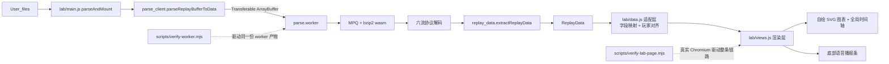

# 维护说明（前端结构）

站点为**零构建**静态资源：GitHub Actions 直接发布仓库根目录，**没有** `npm run build`。
唯一的构建步骤在 CI（`.github/workflows/build-wasm.yml`）：Rust → wasm 与 Worker TypeScript → JS，
产物提交回仓（`wasm/pkg/`、`js/worker/**/*.js`），因此本地无需 Rust / TypeScript 工具链。

> **解析已不依赖 Python。** 旧链路（Pyodide + `sc2reader` + `spawningtool`）已于 2026-09-21 下线，
> 现在是「Rust/WASM 解压 + TypeScript 解码器 + Web Worker」。旧解析脚本作为**冻结参考**留在
> `tools/baseline/parse_script.py`，仅用于重建 `tests/baseline/` 金标准，站点不加载它。

## 本地运行

必须通过 **HTTP** 访问（ES Module 与 `fetch("data.json")` 在 `file://` 下常不可用）：

```bash
python -m http.server 8080
```

浏览器打开 `http://localhost:8080/`（根目录需包含 `index.html`、`css/`、`js/`、`data.json`）。

## 目录与模块职责

> **2026-09-22 起主页面已重做**（「录像数据分析台」）。下表是当前仓库里**全部**前端模块 ——
> 上一代 UI 与共享录像库已在本轮删除，`js/` 下 44 个模块**全部可达、无死代码**（见文末「已删除」）。

### 当前页面（`index.html`）

| 路径 | 职责 |
|------|------|
| [index.html](../index.html) | 页面骨架 + `type="module"` 入口。**只引用 `css/lab.css` 与 `js/lab/main.js`**，无任何 CDN 依赖 |
| [css/lab.css](../css/lab.css) | 主页面设计系统。由 `scripts/extract-lab-css.mjs` 从原型提取 + 追加「运行态外壳」 |
| **[js/lab/main.js](../js/lab/main.js)** | 编排层：文件输入 / 进度 / 错误 → 解析 → 适配 → 挂载；并挂 `window.__lab` 调试句柄 |
| **[js/lab/data.js](../js/lab/data.js)** | **数据适配层**：`ReplayData` → 视图层形状。含 39 字段短名映射、建造项分类（查 `data.json` 名表）、**玩家时间网格对齐** |
| **[js/lab/views.js](../js/lab/views.js)** | 视图层：全部渲染与交互（数据分析视图 / 建造顺序 / 语音播报 / 悬浮探测降级）。**由脚本提取，见下** |
| [js/state.js](../js/state.js) | 跨模块共享状态 `appState`（新页面只用它的 `translationData` 与 `parserReady`） |
| [js/errors_init.js](../js/errors_init.js) | `loadTranslationData()`（读 `data.json`）、`setInitStatus()` |
| [js/parse_client.js](../js/parse_client.js) | **主线程解析门面**：`initParser` / `parseReplayBufferToData` / `isParserReady` / `releaseParser` |
| [js/worker/index.ts](../js/worker/index.ts) | Worker 生命周期与请求/响应配对（`ping` / `parseReplay` / `skipCache`） |
| [js/worker/contract.ts](../js/worker/contract.ts) | 主线程 ↔ Worker 消息契约；`ReplayData` 类型从 `decoder/replay_data.ts` re-export |
| [js/worker/parse.worker.ts](../js/worker/parse.worker.ts) | Worker 入口：收 `parse` → `extractReplayData` → 回 `ok` / `error` |
| [js/worker/decoder/](../js/worker/decoder) | MPQ 容器、六个事件流解码、`build_order` / `stats` / **`stats_series`** / `workers_curve` / `chat` 组装 |
| [js/worker/decoder/data/](../js/worker/decoder/data) | codegen 产出的常量表（`*.generated.ts`，**不要手改**） |
| [data.json](../data.json) | 单位 / 建筑 / 升级译名。**建造顺序的类别判定与中文名都依赖它**，缺了会退化成英文原名 |
| [wasm/src/](../wasm/src) | Rust 侧（bzip2 解压等热点）；`wasm/pkg/` 是产物 |
| [prototype/](../prototype) | **设计来源**：`data-lab.template.html` 是 `extract-lab-*.mjs` 的输入，`overlay-exe.html` 是悬浮窗视觉规格稿。⚠️ 不要删 |
| [tests/baseline/](../tests/baseline) | `ReplayData` 字段级对拍的金标准快照（含 `manifest.json`） |
| [tests/screenshots-lab/](../tests/screenshots-lab) | 生产页面端到端验收的截图产物 |
| [scripts/](../scripts) | codegen（`gen-*.py`）、基准生成、验收（`verify-*.mjs`）、**提取（`extract-lab-*.mjs`）** |
| [docs/](../docs) | 维护说明与调研报告 |

### `js/lab/views.js` 是**提取产物**，不是手写文件

它由 `node scripts/extract-lab-views.mjs` 从 `prototype/data-lab.template.html` 的内联 `<script>`
**逐字节提取**，只做 4 处**有断言保护**的定点替换（运行期注入数据、空数据守卫、去掉自动启动、追加对外接口）。

- **改视图层代码请改原型模板，再重跑提取脚本**。直接改 `views.js` 会在下次提取时被覆盖。
- 提取脚本自带 8 条自检（无 import、DATA 注入、空守卫、顶层自动启动已移除、导出存在、无残留占位符…），
  任一不过就抛错、不产出坏文件。
- 这段代码已过 3 轮真实 Chromium 渲染验收；**后续重构方向**是把 `views.js` 按 section 拆成
  core / metrics / charts / timeline / readouts / table / buildorder / voice / overlay——
  拆完必须重跑 `prototype/shot-datalab.mjs` 与 `scripts/verify-lab-page.mjs`。

### 已删除（2026-09-22 UI 重构）

上一代 UI 与共享录像库**已从仓库删除**（此前保留仅为回退，现已确认无任何页面引用）。
共 14 个模块 + 1 个页面：`css/app.css`、`js/app.js`、`js/batch_rail.js`、`js/benchmarks.js`、
`js/constants.js`、`js/display.js`、`js/display_helpers.js`、`js/export_build.js`、
`js/format_utils.js`、`js/replays_page.js`、`js/share_upload.js`、`js/telemetry.js`、
`js/upload_api.js`、`js/voice_reader.js`，以及 `replays.html`；服务端 `server/` 同批移除。

**怎么确认「确实没人用」**：跑 `node scripts/analyze-module-reachability.mjs`。
它从 `index.html` 的入口脚本出发走完整 import 图，包含 `new Worker(...)` 与
`new URL("...", import.meta.url)` 这类**字符串路径**的边 —— 后者最容易漏，漏了会把整个
`js/worker/**` 误判成死代码。当前结果：**js/ 下 44 个模块全部可达，不可达 0**。
删模块前先跑它，别凭肉眼列清单。

仍**保留**的是 [tools/baseline/parse_script.py](../tools/baseline/parse_script.py) ——
旧解析链路的冻结参考，重建 `tests/baseline/` 金标准要用，**不是死代码**。
回退用的旧页面请从 **git 历史**取（被删文件都是 `git rm`，历史完整；
`prototype/_legacy/` 里另有一份本地归档，但它在 `.gitignore` 里、不入仓）。

**改功能时建议打开的文件：**

- 只改主页面样式 → `css/lab.css`（若要能重复提取，同步改 `scripts/extract-lab-css.mjs` 的 shell 段）
  - **布局类改动**（录像列表侧栏宽度 / 底部播报条与主体对齐 / 页面底部留白）都在该脚本的 shell 段里，
    改完跑 `node scripts/research/probe-layout.mjs` 验几何契约（贴底 / 对齐 / 不遮挡，5 种视口 × 空态与有数据）
  - 该脚本带 9 条自检，关键规则没写进去就**抛错且不写文件**
- 改主页面渲染 / 交互 / 语音 / 悬浮 → `prototype/data-lab.template.html` → 重跑
  `node scripts/extract-lab-views.mjs`
- 改数据形状 / 字段映射 / 建造项分类 / 玩家对齐 → `js/lab/data.js`
- 改文件输入、进度、错误提示 → `js/lab/main.js`
- 改解析字段/逻辑 → `js/worker/decoder/replay_data.ts`（再由 CI 转译）；若改了输出形状，**必须**重跑
  `node scripts/verify-replay-data.mjs`，必要时按下面「重建金标准」流程更新基准
- 改协议解码（新增 ABI / 新版本录像）→ `js/worker/decoder/` + `scripts/gen-protocol-tables.py`
- 改单位/建筑时长表 → `scripts/gen-build-times.py` → `js/worker/decoder/data/build_times.generated.ts`
- 改技能连线（星空加速等）→ `scripts/gen-ability-links.py` → `data/ability_links.generated.ts`
- 改主线程解析时序 / Worker 契约 → `js/parse_client.js` + `js/worker/contract.ts`
- 改单位译名 → `data.json`（会影响建造顺序的分类判定，改完跑一次 `verify-lab-page.mjs`）

## 数据流（简图）


```mermaid
flowchart LR
  userFiles[User_files] --> parseAndMount[lab/main.js parseAndMount]
  parseAndMount --> parseClient[parse_client.parseReplayBufferToData]
  parseClient -->|Transferable ArrayBuffer| worker[parse.worker]
  worker --> mpq[MPQ + bzip2 wasm]
  mpq --> decode[六流协议解码]
  decode --> assemble[replay_data.extractReplayData]
  assemble --> json[ReplayData]
  json --> adapt[lab/data.js 适配层<br/>字段映射 + 玩家对齐]
  adapt --> views[lab/views.js 渲染层]
  views --> charts[自绘 SVG 图表 + 全局时间轴]
  views --> voice[底部语音播报条]
  lab[scripts/verify-lab-page.mjs] -.->|真实 Chromium 驱动整条链路| views
  bench[scripts/verify-worker.mjs] -.->|驱动同一份 worker 产物| worker
```

## 依赖版本（与 README 交叉引用）

- **CDN 依赖：已清零。** 主页面用自绘 SVG 图表（`js/lab/views.js`），不再需要 Chart.js；
  相关的旧图表模块已删除。`js/worker` 与 `wasm/pkg` 全部本地加载。
- **Rust/WASM**：`wasm/` 由 CI 用 wasm-pack 构建为 `wasm/pkg/`；`compute.js` 由 `js/worker/decoder/decompressors.ts` import。
- **TypeScript**：`js/worker/**/*.ts` 由 CI 用 `tsc --project js/worker/tsconfig.json` 转译为同目录 `.js`（提交入仓）。
- **解析语义对齐对象**（**非**运行时依赖，仅用于重建基准）：`sc2reader 1.9.0` + `spawningtool 3.0.0`。

## 解析验收与基准重建

三个脚本都要跑，缺一不可：

| 脚本 | 覆盖面 | 基准 |
|------|--------|------|
| `node scripts/verify-mpq.mjs` | MPQ 容器 + bzip2，5 录像 × 75 个文件条目 | `tests/fixtures/mpq-baseline.json` |
| `node scripts/verify-protocol.mjs` | 六流协议解码，约 8.2 万条事件逐字节 sha256 | `tests/fixtures/protocol-baseline.json` |
| `node scripts/verify-build-order.mjs` | `build_order` 专门口径（含 Egg 精确起点），178 条断言 | `tests/baseline/*.json` |
| `node scripts/verify-replay-data.mjs` | 全量 `ReplayData` 字段级 diff（约 3 万叶值），两趟口径 | `tests/baseline/*.json` |
| `node scripts/verify-worker.mjs` | 真跑 `parse.worker.js` 的端到端通道 + 契约诚实性 | 结构断言 |

**重建金标准**（只在解析口径确实要变时做，属破坏性操作）：

1. 先备份：`cp -r tests/baseline /tmp/baseline-bak-$(date +%Y%m%d-%H%M%S)`
2. 跑 `TMPDIR=<venv>/tmp <venv>/bin/python scripts/freeze-baseline.py`（需 sc2reader 1.9.0 + spawningtool 3.0.0 + mpyq）
3. 与备份逐字节 `diff`。**旧快照没变**才说明这次重跑是无害的；变了就说明基准被换了，
   要么回滚、要么在 `verify-replay-data.mjs` 里把差异逐条定量后登记 —— 不允许直接放过。
4. `tests/baseline/manifest.json` 的 `parse_script_sha256` 指向 `tools/baseline/parse_script.py`。

> 基准的生成源是旧链路 Python，而**对拍判据**是新实现。所以永远不要为了「让新实现过测」去改
> `tools/baseline/parse_script.py` —— 那等于自证。

## 发布

推送至默认分支后，[.github/workflows/static.yml](../.github/workflows/static.yml) 将整仓作为静态资源发布；
**无需**本地打包步骤。改到 `wasm/src/**` 或 `js/worker/**/*.ts` 时，
[.github/workflows/build-wasm.yml](../.github/workflows/build-wasm.yml) 会先重编译产物并提交回仓，
Pages 随后发布的是新产物 —— 所以**不要**手改 `js/worker/**/*.js` 与 `wasm/pkg/`，会被下次构建覆盖。

## ~~上传服务（独立部署）~~ —— 已下线（2026-09）

> **共享上传与共享录像检索已下线**，站点为纯客户端，前端不含任何上传入口。
> `server/`（FastAPI 服务）**既未入仓**（在 `.gitignore` 里）、本机也已不存在 ——
> 下面的接口契约只是历史记录，要恢复功能得重新实现。

- 服务端目录：`server/`（**已移除**）
- 入口：`app.main:app`
- 核心接口（历史）：
  - `POST /api/replays/upload`：接收文件与同意项，二次校验后写入本地队列
  - `GET /api/public/replays`：公共检索（关键词、排序）
  - `POST /api/public/replays/{md5}/like`：点赞（同 IP + 同 md5 10 分钟限流，触发时返回 `429` 与 `retryAfterSeconds`）
  - `PATCH /api/admin/replays/{md5}`：后台管理编辑（Bearer token）
  - `POST /api/telemetry/events`：接收前端埋点
  - `GET /healthz`：健康检查

## 近期交互行为变更

### 2026-09-22 · 主页面重做（录像数据分析台）

- 整页换成「数据分析 / 建造顺序」两个视图 + 常驻底部语音播报条；**去掉 Chart.js CDN，改自绘 SVG 图表**。
- 指标从 5 张图扩到 **28 张**：解析层新增 `stats_series`（列式，`SPlayerStatsEvent` 的 39 个字段
  完整原始采样序列），前端据此出图。`stats[]`（逐分钟摘要）保留不动，仅用于对拍。
- **新增跨玩家时间网格对齐**：真实录像里两名玩家的采样点数常差 1~2 个，而视图层按同一索引
  同时取双方的值 —— 不对齐就会**静默错位**（不报错，只是数据对错时间）。对齐方式 = 采样时刻并集 + 前向填充，
  补点数与重复时刻数在录像列表右侧如实显示。
- 语音播报改为**推进全局时间轴**（不再是独立计时器），切样本 / 切对象 / 改筛选都不打断播放。
- 顶部录像列表取代旧批量侧栏；单份解析失败不影响其余，失败原因在错误条里逐条列出。
- 悬浮按钮改成「真实探测本地组件 → 推送 → 探测不到就降级到 Document 画中画」，状态区如实写明走的是哪条路。
- 顶部录像列表改为**左侧吸顶侧边栏**（236px，与「指标分组」侧栏同宽；≤1180px 退回顶部横排）。
  侧栏含「＋ 添加录像」入口与加载状态提示。
- **底部播报条拆成两层**：`.vb` 只画横跨视口的背景与分隔线，`.vbin`（max-width 1600 居中）
  负责排版 —— 原先 `.vb` 自己 flex，内容从**视口左缘**起排，1920 屏上比主体左边缘偏 **142px**。
  条的实际高度由 `ResizeObserver` 写进 CSS 变量 `--vbh`，供页面底部留白与各吸顶侧栏扣减
  （窄屏条会换行变高，写死 84px 就会压住内容）。
  ⚠️ 页面底部留白加在 `<footer class="pagefoot">` 上，**不能写成 `body{padding-bottom}`** ——
  `lab.css` 里有 `html,body{height:100%}`，body 的 content box 被固定成视口高，
  溢出的内容会**穿过** padding 区域，那条 padding 不产生任何滚动空间。
- `#dropZone` 的显隐**统一走 `style.display`**（`parse_client.js` 就是这么写的）；
  曾因为新代码用 class 切换而两套机制不一致，导致加载完成后拖放区还留在页面上把结果区下推 230px。

### 更早

- ~~共享页 `replays.html` 改为响应式卡片栅格~~、~~解析结果区不再显示上传面板~~、
  ~~批量侧栏新增搜索框~~ —— 这些页面/模块已在 2026-09-22 一并删除。
- 解析内核初始化（`initParser`）改为「拉起 Worker + ping 一次」：Worker 构造成功不等于 wasm 可用，
  所以初始化阶段就主动 ping，把「产物缺失 / MIME 不对」提前暴露，而不是等用户拖进录像才报错。
- `parseReplayBufferToData` 会把 `ArrayBuffer` **Transferable 移交**给 Worker，调用后主线程不再持有它。
  调用方若还需原始字节，请自己先 `buffer.slice(0)` —— 这是旧 API 没有的行为。

## 注意事项

- **不要手改生成物**：`js/worker/decoder/data/*.generated.ts` 由 `scripts/gen-*.py` 产出，
  `js/worker/**/*.js` 与 `wasm/pkg/` 由 CI 产出。改源头，别改结果。
- **不要手改 `js/lab/views.js`**：它是 `scripts/extract-lab-views.mjs` 从
  `prototype/data-lab.template.html` 提取的产物，手改会在下次提取时被覆盖。改原型，再重跑提取。
  两个 `extract-lab-*.mjs` 都带断言：锚点不唯一 / 自检不过就**抛错、不产出坏文件**。
- 重新生成常量表后，用对应脚本的 `--check` 模式确认入库内容与生成器一致（例如
  `python scripts/gen-lobby-properties.py --check`）。
- 新增模块时请避免 **循环 import**。`js/lab/` 的依赖方向：
  `main` → {`data`, `views`}；`data` → 无；`views` 是自洽模块（**不 import 任何东西**）。
  改完跑一次 `node scripts/analyze-module-reachability.mjs`，确认没有模块掉出闭包。
- `js/worker/decoder/replay_data.ts` 里现在有**三套**时间口径，各自有明确的适用面，**不要统一**：
  1. `build_order[].start_time` / `worker_deaths[].time` / `chat[].time` —— Normal 基准，`gameLoop / 16`
  2. `game_length` / `workers_curve[].t` —— spawningtool 常量集 fps（LotV 22.4 / 其余 16）
  3. `stats[].minute` —— **硬编码 `/1.4`**，是旧链路口径错位；只保留用于对拍，**新代码不要用**
  4. `stats_series.t` —— **`gameLoop / fps`，与 `game_length` 同基准**（第 2 套），新图表一律用它
  搞混会让时长与曲线整体偏移；实测 `stats_series` 的尾点落在 `game_length` 的 99.2%~99.9%，可作自检判据。
